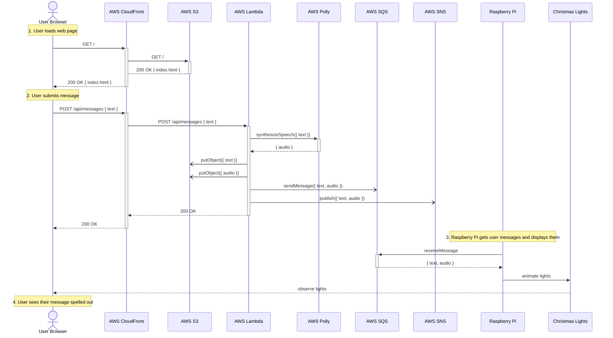

# upside-down-messages

This project displays messages via Christmas lights strung over an alphabet board like in Stranger Things season 1 episode 3.

## Technologies and Equipment

### Software

- [TypeScript](https://www.typescriptlang.org/)
- [Node.js](https://nodejs.org/en/)
- AWS
    - [CDK](https://aws.amazon.com/cdk/)
    - Serverless
        - [CloudFront](https://aws.amazon.com/cloudfront/)
        - [Lambda](https://aws.amazon.com/lambda/)
        - [Polly](https://aws.amazon.com/polly/)
        - [S3](https://aws.amazon.com/s3/)
        - [SNS](https://aws.amazon.com/sns/)
        - [SQS](https://aws.amazon.com/sqs/)

### Hardware

- [Raspberry Pi 3 Model B](https://www.raspberrypi.com/products/raspberry-pi-3-model-b/)
- [ALITOVE WS2811 RGB LED String Lights](https://a.co/d/0QRnQ6d)
- [ALITOVE DC 12V 5A Power Supply](https://a.co/d/bSRcNRz)

## Architecture

