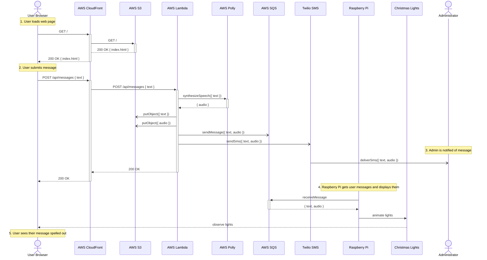

# upside-down-messages

This project displays messages via Christmas lights strung over an alphabet board like in Stranger Things season 1 episode 3.

## Technologies and Equipment

### Hardware

| Product                                                                                | Description                                                                                                | Usage In This Project                                                                                                                  |
| -------------------------------------------------------------------------------------- | ---------------------------------------------------------------------------------------------------------- | -------------------------------------------------------------------------------------------------------------------------------------- |
| [ALITOVE WS2811 12V RGB LED String Lights](https://a.co/d/0QRnQ6d)                     | Also known by the brand name NeoPixels, these are strands of LED lights that are individually addressable. | Two strands are used as the Christmas lights strung over an alphabet board. The 12V models were chosen for better voltage attenuation. |
| [ALITOVE DC 12V 5A Power Supply](https://a.co/d/bSRcNRz)                               | A 12V &times; 5W = 60A power supply that includes a DC terminal connector.                                 | To power the LED light strands.                                                                                                        |
| [Raspberry Pi 3 Model B](https://www.raspberrypi.com/products/raspberry-pi-3-model-b/) | A single-board computer about the size of a credit card with WiFi connectivity.                            | Controls the LED string lights. Optionally, acts as a web server as well when choosing to not deploy to AWS.                           |  |

### Software

| Name                                                        | Description                                                                                                                  | Usage In This Project                                                                                                                                                                            |
| ----------------------------------------------------------- | ---------------------------------------------------------------------------------------------------------------------------- | ------------------------------------------------------------------------------------------------------------------------------------------------------------------------------------------------ |
| [TypeScript](https://www.typescriptlang.org/)               | TypeScript is a strongly typed programming language that builds on JavaScript, giving you better tooling at any scale.       | Used in place of JavaScript, both client-side and server-side.                                                                                                                                   |
| [Node.js](https://nodejs.org/en/)                           | Node.js® is an open-source, cross-platform JavaScript runtime environment.                                                   | Executes the server-side code, whether executing on the Raspberry Pi or in AWS.                                                                                                                  |
| [GreenSock Animation Platform](https://greensock.com/gsap/) | Professional-grade JavaScript animation for the modern web.                                                                  | Even though this is typically used client-side in web pages, it also can be used in Node.js. In this case, it is used on the Raspberry Pi to create timelines to animate the LEDs string lights. |
| [AWS CDK](https://aws.amazon.com/cdk/)                      | AWS Cloud Development Kit (CDK) accelerates cloud development using common programming languages to model your applications. | Scripts the deployment to AWS.                                                                                                                                                                   |
| [Snowstorm](http://www.schillmania.com/projects/snowstorm/) | A JavaScript Snow Effect for HTML.                                                                                           | Creates the Stranger Things floating spores effect                                                                                                                                               |

### Cloud Services

| Name                                                 | Description                                                                                                                                                                                  | Usage In This Project                                                                                                                                                                                                      |
| ---------------------------------------------------- | -------------------------------------------------------------------------------------------------------------------------------------------------------------------------------------------- | -------------------------------------------------------------------------------------------------------------------------------------------------------------------------------------------------------------------------- |
| [AWS CloudFront](https://aws.amazon.com/cloudfront/) | Amazon CloudFront is a content delivery network (CDN) service built for high performance, security, and developer convenience.                                                               | Presents a CDN front for both the static website and the REST API.                                                                                                                                                         |
| [AWS Route 53](https://aws.amazon.com/route53/)      | Amazon Route 53 is a highly available and scalable Domain Name System (DNS) web service.                                                                                                     | Aliases a friendly domain name to the CloudFront distribution.                                                                                                                                                             |
| [AWS S3](https://aws.amazon.com/s3/)                 | Amazon Simple Storage Service (Amazon S3) is an object storage service offering industry-leading scalability, data availability, security, and performance.                                  | Hosts the static web site, as well as saving user-submitted messages and Polly-generated audio.                                                                                                                            |
| [AWS Lambda](https://aws.amazon.com/lambda/)         | AWS Lambda is serverless, event-driven compute that lets you run code for virtually any type of application or backend service without provisioning or managing servers.                     | Executes the  REST API, implemented using Node.js + Express.                                                                                                                                                               |
| [AWS Polly](https://aws.amazon.com/polly/)           | Amazon Polly synthesizes natural-sounding human speech from text.                                                                                                                            | The original intent was to add spooky voice sound effects as though Will was somehow speaking from the Upside Down. While the invocation of Polly is implemented, it remains optional and the resulting audio is not used. |
| [AWS SQS](https://aws.amazon.com/sqs/)               | Amazon Simple Queue Service (SQS) lets you send, store, and receive messages between software components at any volume, without losing messages or requiring other services to be available. | Ushers user-submitted messages between the REST API and the Raspberry Pi.                                                                                                                                                  |
| [Twilio SMS](https://twilio.com)                     | Send and receive text messages with just a few lines of code on MessagingX, the trusted platform for cross-channel messaging.                                                                | Sends text messages to the administrator whenever a user submits a message.                                                                                                                                                |

Usage levels for this project were sufficiently low they they:

- qualified for free tier (CloudFront, Lambda, Polly, SQS),
- were extremely nexpensive (Route 53, S3), or
- fit withing the free trial credits (Twilio).

## Architecture

